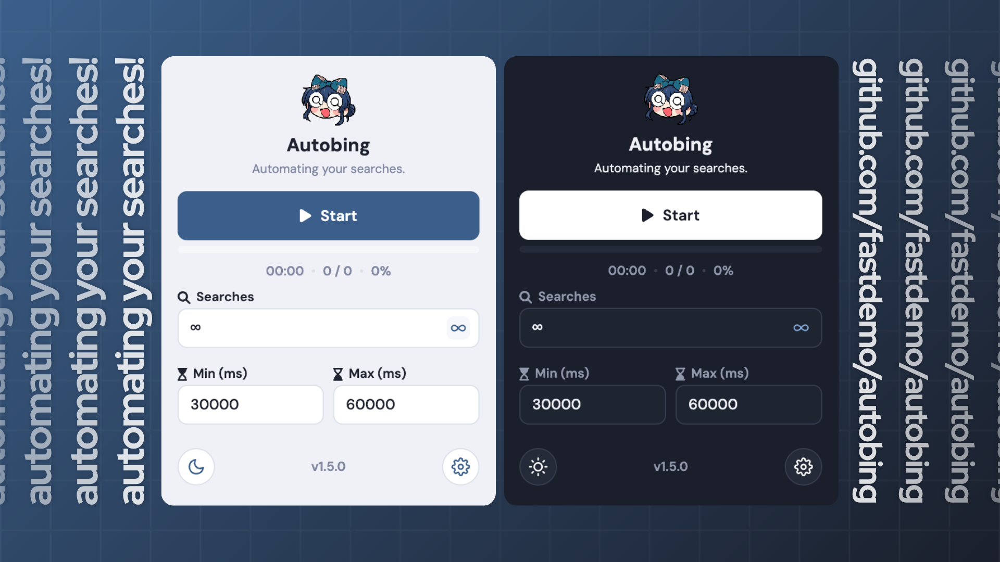

# Autobing

Automates Bing searches with a lightweight Chromium extension!

## Highlights

Autobing generates random Bing queries, runs them in an active tab, and keeps the session visible with a live progress and metric UI.

## Images



## Features

- **Automated searches**: Run a chosen amount of searches with timing inbetween.
- **Adjustable timing**: Set minimum and maximum delays between searches in milliseconds.
- **Natural query generation**: Creates completely unique search queries by combining customizable descriptors, categories, and extra details without repeating combinations in a large pool of queries.
- **Visit search results**: Randomly opens a search result every few searches, to emulate human behavior.
- **Eco Mode**: Allows you to hide Bing content when the extension is running in the background to save your computer's precious resources!

## Install

1. Clone the repo:

   ```bash
   git clone https://github.com/fastdemo/autobing.git
   ```

2. Open `chrome://extensions/`.
3. Turn on Developer mode.
4. Click Load unpacked.
5. Select the extension folder.

## Usage

1. Click the Autobing icon in the toolbar.
2. Adjust the amount of search queries that you want to automate.
3. Set the minimum and maximum delay in milliseconds.
4. Click Start and keep that Bing tab open while the session runs.
5. Enable or disable additional features in the Settings tab, while also keeping an eye on the metrics.

Preferences are stored locally by the extension and can be restored from the Settings view.

## License

MIT. See [LICENSE](LICENSE).

## Disclaimer

Not affiliated with Microsoft or the Microsoft Rewards program whatsoever. Use it responsibly and aligned with Microsoft's ToS *(at your own risk, of course).*

## Credits

- **Iago** - a Japanese learning app. Their mascot art style is the inspiration for Autobing's mascot, Shion Yorigami *(aka Poverty God, aka the kind of people who would use this extension lol)* from Touhou Project!

This is a completely open-source project and I have no intentions of profiting from this. If you're uncomfortable with any of the borrowed assets, feel free to reach out and I'll take it down!

Made with love by **@fastdemo** <3
